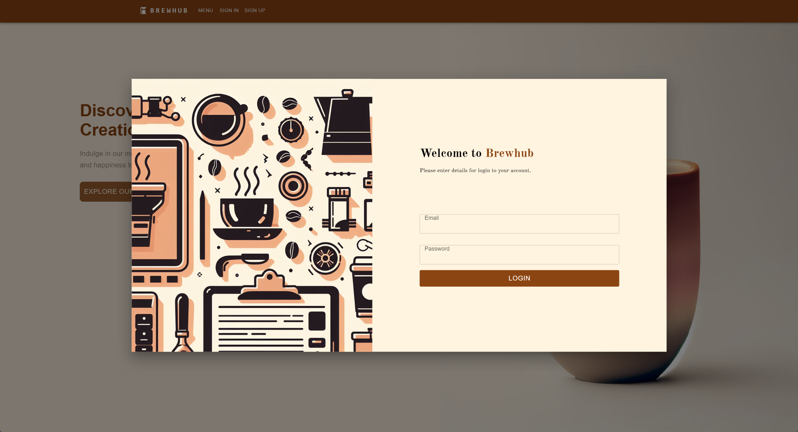
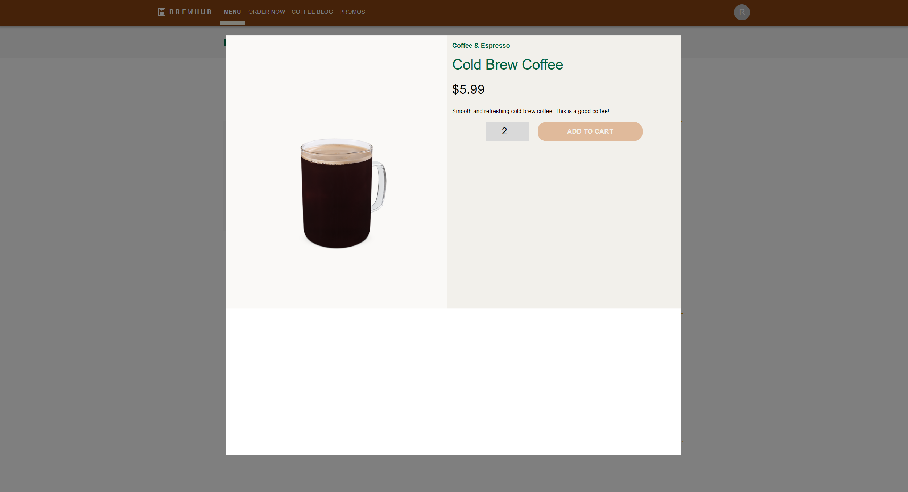
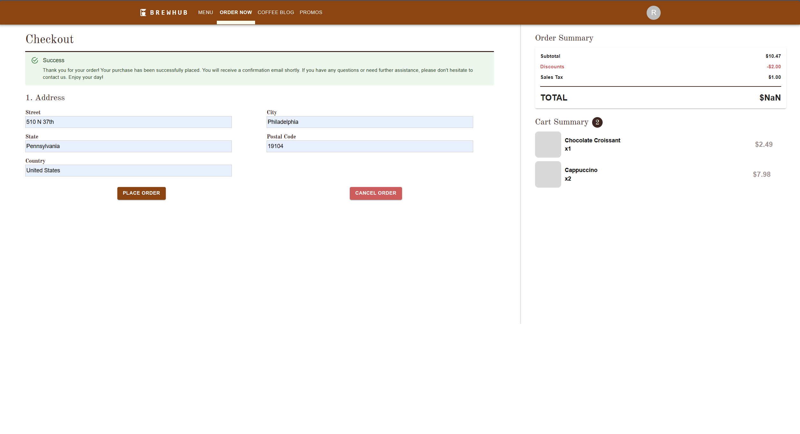
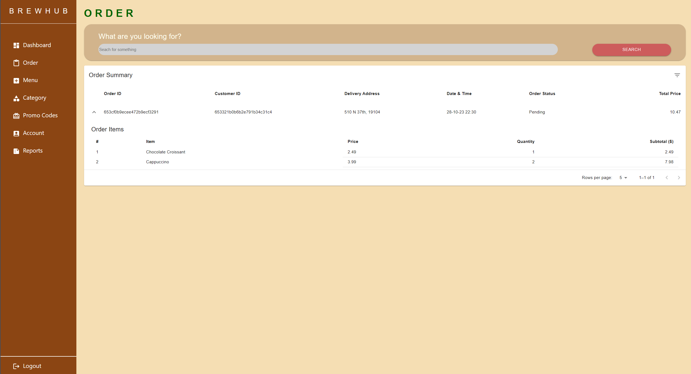

# Brewhub Client - React App

Welcome to the Brewhub Client, the front-end of our Coffee Business Web Application. This React app provides an intuitive interface for users to interact with the Brewhub platform.

### Screenshot 5: Sign In Modal Box


### Screenshot 6: Menu Item View Page


### Screenshot 7: Successful Order Page


### Screenshot 8: Order Admin Page



## Table of Contents

- [Getting Started](#getting-started)
  - [Prerequisites](#prerequisites)
  - [Installation](#installation)
- [Usage](#usage)
- [License](#license)
- [Technologies Used](#technologies-used)

## Getting Started

### Prerequisites

Before you start, make sure you have the following software installed:

- [Node.js](https://nodejs.org/) (version >= 14.0.0)
- [npm](https://www.npmjs.com/) (version >= 6.0.0)

### Installation

1. Clone the repository:

   ```bash
   git clone https://github.com/jamesngn/brewhub-app.git

2. Navigate to the client directory:

   ```bash
   cd brewhub-app/client
   ```

3. Install dependencies:

   ```bash
   npm install
   ```

4. Start the React app:

   ```bash
   npm start
   ```

   The app will be running at `http://localhost:3000`.

## Usage

- Once the app is running, open a web browser and navigate to `http://localhost:3000`.
- Explore the various features of the Brewhub application from the user interface.


## License

This project is licensed under the [MIT License](../LICENSE).


## Technologies Used

- [Material-UI](https://material-ui.com/) for UI components and styles.
- [React ApexCharts](https://apexcharts.com/) for interactive charts.
- [Figma](https://www.figma.com/file/wSqDXU9vsJ6d0jOr3JoRJC/brewhub-app?type=design&node-id=0%3A1&mode=design&t=r7gwpJq60erj4d2g-1) for UI design and prototyping.

---

Feel free to reach out with any questions or feedback. Happy brewing!

**Brewhub** - *Brewing Excellence in Every Cup*

